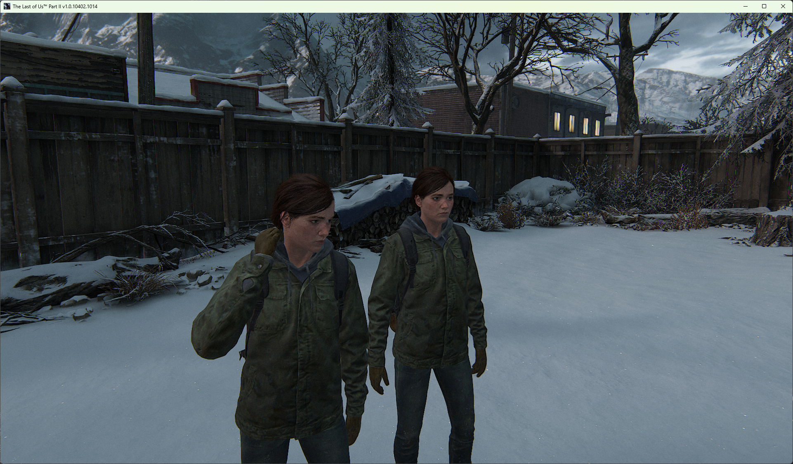

# TLOU2 Co-op Hook

  

  Experimental attempt at a 2 player co-op mode for The Last of Us Part II Remastered on PC. Work in progress, not functional yet.

## Info

The Last of Us Part II Remastered on PC has no multiplayer or co-op mode. Naughty Dog cancelled The Last of Us Online in December 2023 and nothing replaced it.

This project tries to add one anyway, a second player alongside the main character, by hooking internal engine functions from a DLL injected into the game process.

## Status

Automatic injection into `tlou-ii.exe`, the real game process.

Position sync between two running instances over local UDP.

Automatic identification of Ellie and the AI companion among all active entities.

Manual, fragile spawning of a second player instance via F10, currently just a visual clone, not an independently controllable Process.

No NPC state synchronization yet, which is the actual hard problem and remains unsolved.

## Documentation

Full technical writeup, memory offsets, structures, and every abandoned lead, is in [DOCS_TECHNIQUE.md](DOCS_TECHNIQUE.md)

## Tools

ndmodloader, dconstruct, ndarc, x64dbg, IDA, MinHook.

## Disclaimer

Reverse engineering of a commercial game. No Naughty Dog assets or proprietary code redistributed, only original hook code. Personal, offline, experimental use.
